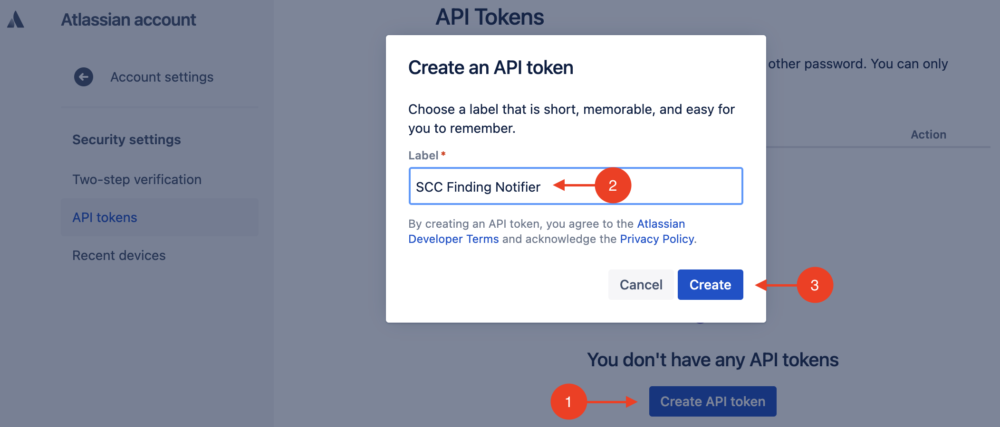
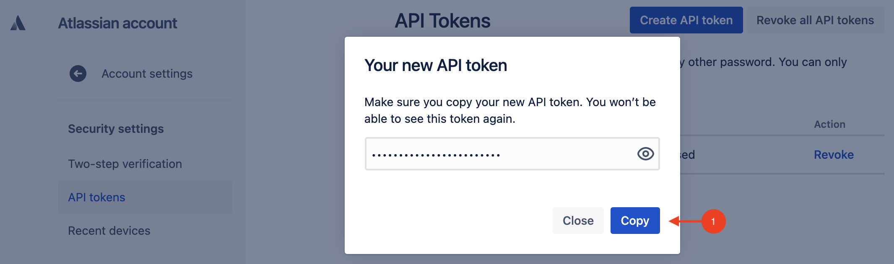

# Create and Update Jira Tickets on SCC Finding Notifications

This repository provides a GCP cloud function that will create and update Jira tickets in an [Atlassian Cloud](https://www.atlassian.com/cloud) instance when a finding is published to GCP's Security Command Center.

## Overview

- Generate an Atlassian API token that will authorize our cloud function to create and update Jira tickets.
- Configure Security Command Center to publish notifications to Cloud Pub/Sub when findings are created or updated.
- Create and deploy a cloud function that subscribes to Cloud Pub/Sub and creates and updates Jira tickets when notifications are received from the Cloud Pub/Sub topic.

## Step-by-Step

### Generate an Atlassian API Token

In this section, we will generate an Atlassian API token that will authorize our cloud function to create and update Jira tickets in an Atlassian Cloud instance.

1. Navigate to your [Atlassian Account](https://id.atlassian.com/manage-profile/security/api-tokens).

1. Click **_Create API token_**, then under **_Label_** type **_SCC Finding Notifier_**, then click **_Create_**.

   

1. In the **_Your new API token_** modal, click **_Copy_** and save the value for later.

   

### Open a Terminal

The rest of this tutorial will be performed in both a terminal and console.

1. Open a [Cloud Shell Console](https://ssh.cloud.google.com/cloudshell/editor), or a shell with the [gcloud CLI](https://cloud.google.com/sdk/gcloud) installed.

1. Clone this repository locally and make it the current working folder.

   ```shell
   git clone https://github.com/shadanan/gcp-scc-finding-notification-jira-cloud.git
   cd gcp-scc-finding-notification-jira-cloud
   ```

1. In the shell that we prepared at the beginning, set the org and project ID. The selected project is where the cloud function will execute form.

   ```shell
   export ORG_ID=<your org id>
   export PROJECT_ID=<your project id>
   gcloud config set project $PROJECT_ID
   ```

### Configure the Pub/Sub Topic and Subscription

Cloud Pub/Sub is a real-time messaging service that enables messages to be sent and received between independent applications. A publisher creates a message and publishes it to a feed of messages called a topic. A subscriber receives these messages by way of a subscription. In our case, we'll have a cloud function that updates Jira when SCC finding notifications are published to the topic.

1. Create the topic where all the findings will be published.

   ```shell
   export TOPIC=scc-findings-topic
   gcloud pubsub topics create $TOPIC
   ```

1. Configure SCC to publish notifications to our topic.

   ```shell
   gcloud scc notifications create scc-findings-notify \
     --organization $ORG_ID --pubsub-topic projects/$PROJECT_ID/topics/$TOPIC
   ```

### Create a Service Account for our cloud function

In this section, we'll provision a service account that will be used by our cloud function. These instructions are adapted from the [public documentation](https://cloud.google.com/security-command-center/docs/how-to-programmatic-access).

1. Create the service account.

   ```shell
   export SERVICE_ACCOUNT=jira-cloud-function-sa
   gcloud iam service-accounts create $SERVICE_ACCOUNT \
     --display-name "SCC Finding Notifier Jira cloud function" \
     --project $PROJECT_ID
   ```

### Create a Firestore Database to Track Jira Tickets

In this section, we will create a Firestore database instance that will maintain a mapping between the Security Command Center finding names and the Jira issue keys. This will enable our cloud function to create new issues, and automatically close existing issues when the findings are resolved.

1. Create an App Engine app.

   ```shell
   gcloud app create --region=us-central
   gcloud firestore databases create --region=us-central
   ```
2. Create a firestore db (native mode)
   
   
   


### Save Atlassian API Token in Secrets Manager

1. Export the Atlassian API Token into an environment variable.

   ```shell
   export ATLASSIAN_API_TOKEN=<your-app-secret>
   ```

1. Create the token.

   ```shell
   gcloud secrets create atlassian-api-token
   ```

1. Set the value of the token.

   ```shell
   echo -n $ATLASSIAN_API_TOKEN | gcloud secrets versions add atlassian-api-token --data-file=-
   ```

1. Grant the service account access to the token.

   ```shell
   gcloud secrets add-iam-policy-binding atlassian-api-token \
     --member="serviceAccount:$SERVICE_ACCOUNT@$PROJECT_ID.iam.gserviceaccount.com" \
     --role='roles/secretmanager.secretAccessor'
   ```
   **Incase you get Secret manager access denied despite correct roles for service account try this:**
    - You can find the serviceAccount that looks like this ```<project-name>@appspot.gserviceaccount.com``` from the deployment information details of cloud function.
    - In IAM Admin, Add Secret Manager Secret Accessor Role to this Service Account.
      
### Configure and Publish the Cloud Function

Jira deployments are highly configurable. The cloud function needs to know the type of issue to publish, and which status columns to use for active and inactive findings.

1. Set the Jira issue type, the status column for new Jira tickets, and the status column for closed Jira tickets. For some board configurations, you should use "To Do" instead of "Backlog" for `STATUS_OPEN`.


2. Set the Atlassian user ID (typically your email address), domain and project key. The domain can be extracted from Jira's URL. The URL will have the following form:

   `https://<your-domain>.atlassian.net/`

   You can find your project key at this URL:

   `https://<your-domain>.atlassian.net/jira/projects`
    

    
  

1. Deploy the `update-jira-findings` cloud function.Ensure Cloud Build API is enabled

   

### Test It Out

1. In Security Command Center, ensure **_Show Inactive_** checkbox is ticked so that the findings don't disappear after you deactivate one. Then, manually deactivate and reactivate some findings in order to trigger the cloud function.

 

 **Incase your Cloud function isn't getting triggered try this:**
 - Click on **_Export_** and select Cloud Pub/Sub
 - select your Pub/Sub topic
 - Repeat step above
 

1. Refresh the Kanban board!

   
