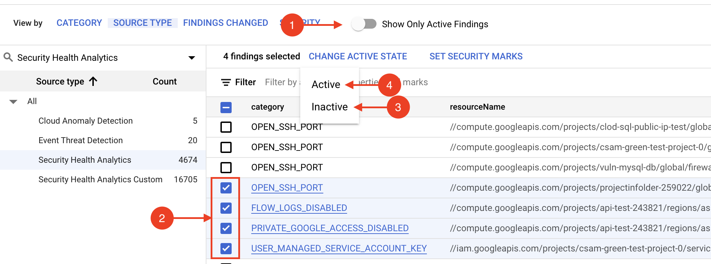

# Create and Update Jira Tickets on SCC Finding Notifications

This repository provides a GCP cloud function that will create and update Jira tickets in an [Atlassian Cloud](https://www.atlassian.com/cloud) instance when a finding is published to GCP's Security Command Center.

## Overview

- Generate an Atlassian API token that will authorize our cloud function to create and update Jira tickets.
- Configure Security Command Center to publish notifications to Cloud Pub/Sub when findings are created or updated.
- Create and deploy a cloud function that subscribes to Cloud Pub/Sub and creates and updates Jira tickets when notifications are received from the Cloud Pub/Sub topic.

## Step-by-Step

### Generate an Atlassian API Token

In this section, we will generate an Atlassian API token that will authorize our cloud function to create and update Jira tickets in an Atlassian Cloud instance.

1. Navigate to your [Atlassian Account](https://id.atlassian.com/manage-profile/security/api-tokens).

1. Click **_Create API token_**, then under **_Label_** type **_SCC Finding Notifier_**, then click **_Create_**.

   

1. In the **_Your new API token_** modal, click **_Copy_** and save the value for later.

   

### Open a Terminal

The rest of this tutorial will be performed in a terminal.

1. Open a [Cloud Shell Console](https://ssh.cloud.google.com/cloudshell/editor), or a shell with the [gcloud CLI](https://cloud.google.com/sdk/gcloud) installed.

1. Clone this repository locally and make it the current working folder.

   ```console
   $ git clone https://github.com/shadanan/gcp-scc-finding-notification-jira-cloud.git
   $ cd gcp-scc-finding-notification-jira-cloud
   ```

1. In the shell that we prepared at the beginning, set the org and project ID. The selected project is where the cloud function will execute form.

   ```console
   $ export ORG_ID=<your org id>
   $ export PROJECT_ID=<your project id>
   $ gcloud config set project $PROJECT_ID
   ```

### Configure the Pub/Sub Topic and Subscription

Cloud Pub/Sub is a real-time messaging service that enables messages to be sent and received between independent applications. A publisher creates a message and publishes it to a feed of messages called a topic. A subscriber receives these messages by way of a subscription. In our case, we'll have a cloud function that updates Jira when SCC finding notifications are published to the topic.

1. Create the topic where all the findings will be published.

   ```console
   $ gcloud pubsub topics create scc-findings-topic
   $ export TOPIC=projects/$PROJECT_ID/topics/scc-findings-topic
   ```

1. Configure SCC to publish notifications to our topic.

   ```console
   $ gcloud scc notifications create scc-findings-notify \
       --organization $ORG_ID --pubsub-topic $TOPIC
   ```

### Create a Service Account for our cloud function

In this section, we'll provision a service account that will be used by our cloud function. These instructions are adapted from the [public documentation](https://cloud.google.com/security-command-center/docs/how-to-programmatic-access).

1. Create the service account.

   ```console
   $ export SERVICE_ACCOUNT=jira-cloud-function-sa
   $ gcloud iam service-accounts create $SERVICE_ACCOUNT \
       --display-name "SCC Finding Notifier Jira cloud function" \
       --project $PROJECT_ID
   ```

### Create a Firestore Database to Track Jira Tickets

In this section, we will create a Firestore database instance that will maintain a mapping between the Security Command Center finding names and the Jira issue keys. This will enable our cloud function to create new issues, and automatically close existing issues when the findings are resolved.

1. Create the Firestore database instance.

   ```console
   $ gcloud firestore databases create --region=us-central
   ```

1. Grant the service account access to the Firestore database.

   ```console
   $ gcloud projects add-iam-policy-binding $PROJECT_ID \
       --member="serviceAccount:$SERVICE_ACCOUNT@$PROJECT_ID.iam.gserviceaccount.com" \
       --role='roles/datastore.user'
   ```

### Save Atlassian API Token in Secrets Manager

1. Export the Atlassian API Token into an environment variable.

   ```console
   $ export ATLASSIAN_API_TOKEN=<your-app-secret>
   ```

1. Create the token.

   ```console
   $ gcloud secrets create atlassian-api-token
   ```

1. Set the value of the token.

   ```console
   $ echo -n $ATLASSIAN_API_TOKEN | gcloud secrets versions add atlassian-api-token --data-file=-
   ```

1. Grant the service account access to the token.

   ```console
   $ gcloud secrets add-iam-policy-binding atlassian-api-token \
     --member="serviceAccount:$SERVICE_ACCOUNT@$PROJECT_ID.iam.gserviceaccount.com" \
     --role='roles/secretmanager.secretAccessor'
   ```

### Publish the cloud function

1. Set the Atlassian user ID (typically your email address), domain and project key. The domain and project key can be extracted from Jira's Kanban board URL. The URL will have the following form:

   `https://<your-domain>.atlassian.net/secure/RapidBoard.jspa?projectKey=<your-project-key>`

   ```console
   $ export USER_ID=<your-user-id>
   $ export DOMAIN=<your-domain>
   $ export JIRA_PROJECT_KEY=<your-project-key>
   ```

1. Deploy the `update-jira-findings` cloud function. If you have not enabled Cloud Build API, then this command may fail. Follow the link in the error message to enable it and then try again.

   ```console
   $ gcloud functions deploy update-jira-findings \
       --entry-point=process_notification \
       --runtime=python39 \
       --service-account="$SERVICE_ACCOUNT@$PROJECT_ID.iam.gserviceaccount.com" \
       --set-env-vars="PROJECT_ID=$PROJECT_ID,USER_ID=$USER_ID,DOMAIN=$DOMAIN,JIRA_PROJECT_KEY=$JIRA_PROJECT_KEY" \
       --source=cf \
       --trigger-topic=scc-findings-topic
   ```

### Test It Out

1. In Security Command Center, ensure **_Show Only Active Findings_** is off so that the findings don't disappear after you deactivate one. Then, manually deactivate and reactivate some findings in order to trigger the cloud function.

   

1. Refresh the Kanban board!

   
